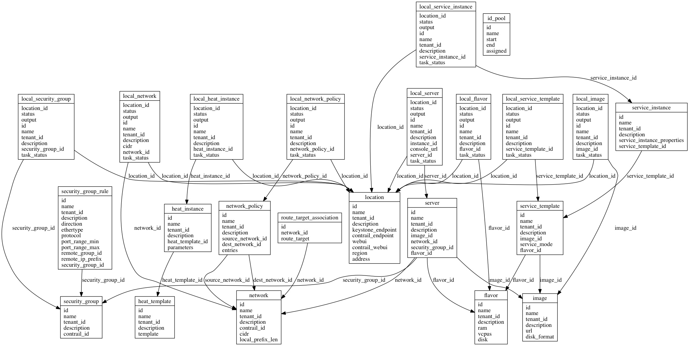

** OpenContrail Global Controller v1.0 **

# Introduction

## Purpose

The goal of OpenContrail Global Controller is to provide seamless experience on multiple region.
cloud environment. Generally, we will separate failure domain using Region concept on multiple region environment
in order to provide high availability. However, there are burden to connect or configuring
 servers and virtual machines over multiple different regions.

The Global Controller has two main responsibility, resource ID management and multiple location resource provisioning.

## Scope

### Centralized resource identifier management

We have multiple kinds of identifiers (IDs), which are needed to coordinated in centralized location,
 such as Route Target, Virtual Network IDs, Security Groups ID.
OpenContrail can interconnect virtual networks (VNs) in different Data Centers using BGP VPN technology (RFC4364).
BGP VPN realizes virtual private networks (VPNs) using Route Target identifier (RFC4360).
We need to coordinate route target ID ranges if we inter connect multiple DCs. In order to automate this process.
Virtual network ID is similar with route target. It is used to identify same virtual networks in different DCs for preventing looping in
service chaining described later.
Security Group IDs are used to identify same security group, so that we can use same security group policy over multiple
DCs. It is operational burden for users if we can't use same security group over multiple region, because we need
to configure to allow traffic from all route in a same virtual networks.
OpenContrail Global Controller manages these identifiers.

### Multiple location resource provisioning

We have many use-cases need to have same resource need to be existing in multiple DCs such as Policy or services.
Let's say we have a security policy to apply firewall (FW) for any traffic for application server network which exists in multiple
locations. We need to have same virtual network, network policy, and FWs in each location.
OpenContrail Global Controller automates this process.

## Assumption and Constraints

- We expect each DC has different OpenStack + OpenContrail regions.
- Each regions are managed under in same OpenStack Keystone, or Keystone data need to be replicated with
 multiple DCs SSO support such as fernet token.
- OpenContrail Global Controller has secure API connection for each OpenStack & OpenContrail Regions.
- Each OpenContrail need to get peering by eBGP or iBGP. Note that eBGP is recommended.
- Each OpenStack keystone has admin account for OpenContrail Global Contrail, and the account
should be authorized to manage resources in each region.

# Functional Requirements

## Location

OpenContrail Global controller must be able to manage multiple DCs location.
OpenContrail Global controller also responsible for creating necessary resource when a location added.

## ID pool

OpenContrail Global controller must be able to manage pool of identifier including route_target,
virtual_network_id and security_group_id.

## Network

OpenContrail Global controller must be able to manage global network. OpenContrail Global controller
assign a route target and virtual network ID for each network. A user can create local network on each region.
OpenContrail Global controller create a virtual network resource with necessary configuration on each locations.

## Security Group

OpenContrail Global controller must be able to manage global security group.
OpenContrail Global controller assign one security group ID when the resource created, and
create it automatically on each location.

## Image

OpenContrail Global controller must be able to manage global image.
OpenContrail Global controller  create local copy of global image automatically on each location.

## Service Template

OpenContrail Global controller must be able to manage global service template.
OpenContrail Global controller create local copy of global service template automatically on each location.

## Service Instance

OpenContrail Global controller must be able to manage global service instance.
OpenContrail Global controller create local copy of global service instance automatically on each location.

## Network Policy

OpenContrail Global controller must be able to manage global network policy.
OpenContrail Global controller create local copy of global network policy automatically on each location.

## Heat

OpenContrail Global controller must be able to manage global heat resource.
OpenContrail Global controller create local copy of global heat resource automatically on each location.

# Non functional requirements

## Error handling

- support recover resources when we faced failure on each data centers

## Security

- Support HTTPs
- Prevent SQL Injection Attack
- Prevent Command Injection Attack
- Support OpenStack keystone authentication

## High Availability

- Support Active-Active for OpenContrail Global Controller using
  load balancers such as HAProxy
- OpenContrail Global Controller expect backend RDBMS support master-slave type HA

## Performance Target

OpenContrail Global Controller targets

- 3000 req/sec for read request
- 1000 req/sec for configuration update request
- up to 50 DCs

## Hot reload

- Support hot reload on configuration change or restart

## Standard

- Support REST Style API

## Version

- OpenStack version: higher than liberty release
- OS: Ubuntu 14:04 or higher
- OpenContrail: 3.0 or higher

# Design

## Data Model

OpenContrail Global controller manages four types of models. Location, Global resource models, local resource models, and
 identify pools.

- Location represent each DCs containing access endpoint information.
- Global resource models manages global resource configuration.
- Local resource models manages resource status in each location.
- ID pool manages ranges of resource identifiers.

## API Specification
