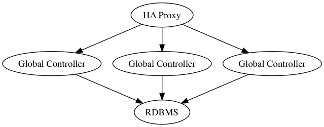
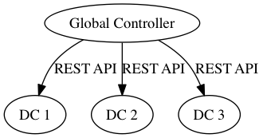
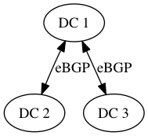

** OpenContrail Global Controller v1.0 **

# Introduction

## Purpose

The goal of OpenContrail Global Controller is to provide seamless experience on multiple region.
cloud environment. Generally, we will separate failure domain using Region concept on multiple region environment
in order to provide high availability. However, there are burden to connect or configuring
 servers and virtual machines over multiple different regions.

The Global Controller has two main responsibility, resource ID management and multiple location resource provisioning.

## Scope

### Centralized resource identifier management

We have multiple kinds of identifiers (IDs), which are needed to coordinated in centralized location,
 such as Route Target, Virtual Network IDs, Security Groups ID.
OpenContrail can interconnect virtual networks (VNs) in different Data Centers using BGP VPN technology (RFC4364).
BGP VPN realizes virtual private networks (VPNs) using Route Target identifier (RFC4360).
We need to coordinate route target ID ranges if we inter connect multiple DCs. In order to automate this process.
Virtual network ID is similar with route target. It is used to identify same virtual networks in different DCs for preventing looping in
service chaining described later.
Security Group IDs are used to identify same security group, so that we can use same security group policy over multiple
DCs. It is operational burden for users if we can't use same security group over multiple region, because we need
to configure to allow traffic from all route in a same virtual networks.
OpenContrail Global Controller manages these identifiers.

### Multiple location resource provisioning

We have many use-cases need to have same resource need to be existing in multiple DCs such as Policy or services.
Let's say we have a security policy to apply firewall (FW) for any traffic for application server network which exists in multiple
locations. We need to have same virtual network, network policy, and FWs in each location.
OpenContrail Global Controller automates this process.

## Assumption and Constraints

- We expect each DC has different OpenStack + OpenContrail regions.
- Each regions are managed under in same OpenStack Keystone, or Keystone data need to be replicated with
 multiple DCs SSO support such as fernet token.
- OpenContrail Global Controller has secure API connection for each OpenStack & OpenContrail Regions.
- Each OpenContrail need to get peering by eBGP or iBGP. Note that eBGP is recommended.
- Each OpenStack keystone has admin account for OpenContrail Global Contrail, and the account
should be authorized to manage resources in each region.

# Functional Requirements

## Location

OpenContrail Global controller must be able to manage multiple DCs location.
OpenContrail Global controller also responsible for creating necessary resource when a location added.

## ID pool

OpenContrail Global controller must be able to manage pool of identifier including route_target,
virtual_network_id and security_group_id.

## Network

OpenContrail Global controller must be able to manage global network. OpenContrail Global controller
assign a route target and virtual network ID for each network. A user can create local network on each region.
OpenContrail Global controller create a virtual network resource with necessary configuration on each locations.

## Security Group

OpenContrail Global controller must be able to manage global security group.
OpenContrail Global controller assign one security group ID when the resource created, and
create it automatically on each location.

## Image

OpenContrail Global controller must be able to manage global image.
OpenContrail Global controller  create local copy of global image automatically on each location.

## Service Template

OpenContrail Global controller must be able to manage global service template.
OpenContrail Global controller create local copy of global service template automatically on each location.

## Service Instance

OpenContrail Global controller must be able to manage global service instance.
OpenContrail Global controller create local copy of global service instance automatically on each location.

## Network Policy

OpenContrail Global controller must be able to manage global network policy.
OpenContrail Global controller create local copy of global network policy automatically on each location.

## Heat

OpenContrail Global controller must be able to manage global heat resource.
OpenContrail Global controller create local copy of global heat resource automatically on each location.

# Non functional requirements

## Error handling

- support recover resources when we faced failure on each data centers

## Security

- Support HTTPs
- Prevent SQL Injection Attack
- Prevent Command Injection Attack
- Support OpenStack keystone authentication

## High Availability

- Support Active-Active for OpenContrail Global Controller using
  load balancers such as HAProxy
- OpenContrail Global Controller expect backend RDBMS support master-slave type HA

## Performance Target

OpenContrail Global Controller targets

- 3000 req/sec for read request
- 1000 req/sec for configuration update request
- up to 50 DCs

## Hot reload

- Support hot reload on configuration change or restart

## Standard

- Support REST Style API

## Version

- OpenStack version: higher than liberty release
- OS: Ubuntu 14:04 or higher
- OpenContrail: 3.0 or higher

# Design

## Data Model

OpenContrail Global controller manages four types of models. Location, Global resource models, local resource models, and
 identify pools.

- Location represent each DCs containing access endpoint information.
- Global resource models manages global resource configuration.
- Local resource models manages resource status in each location.
- ID pool manages ranges of resource identifiers.


## API Specification
Common
=========

HTTP Header

X-Auth-Token:  keystone Token

Common HTTP Status

| Code | Status | Description |
|------|--------|-------------|
| 401  | Unauthorized | Authentication required or you don't have permission to perform action for a resource |
| 404  | Not Found |  Resource Not Found |
| 500  | Internal Server Error | Server Side issue occurred.. Please contact administrator |

- Not Found: 404  Resource Not Found
- Internal Server Error: 500  Server Side issue occurred.. Please contact administrator


Location
============================

Description: Location represents each datacenters

Properties
------------

| Key | Title | Description | Type | Default |  Format | Permission |
| ----- | ------- | ------------- | ------ | --------- | --------- | ------------ |
| id | ID | ID | string |  | uuid |  |
| name | Name | Name | string |  |  |  |
| tenant_id | Tenant ID | Tenant ID | string |  |  |  |
| description | Description | Description | string |  |  |  |
| keystone_endpoint | Keystone endpoint | Keystone endpoint | string |  | uri |  |
| contrail_endpoint | Contrail endpoint | Contrail endpoint | string |  | uri |  |
| webui | Webui | WebUI link | string |  | uri |  |
| contrail_webui | Contrail Webui | Contrail WebUI link | string |  | uri |  |
| region | Region | Region | string |  |  |  |
| address | Endpoint address | Endpoint address | string |  |  |  |

Note: it is mandatory property if there is no default value specified.
id is an exception. if id property is null, gohan server will put uuid.

API Endpoint

List API
-----------

GET /v1.0/locations

Sample Output

HTTP Status Code: 200 (OK)


``` json

  {
    "locations": [
      {

        "id": $id,
        "name": $name,
        "tenant_id": $tenant_id,
        "description": $description,
        "keystone_endpoint": $keystone_endpoint,
        "contrail_endpoint": $contrail_endpoint,
        "webui": $webui,
        "contrail_webui": $contrail_webui,
        "region": $region,
        "address": $address
      }
    ]
  }

```

Show API
-----------

GET /v1.0/locations/:id

Sample Output

HTTP Status Code: 200 (OK)

``` json

  {
    "location": { 
        "id": $id,
        "name": $name,
        "tenant_id": $tenant_id,
        "description": $description,
        "keystone_endpoint": $keystone_endpoint,
        "contrail_endpoint": $contrail_endpoint,
        "webui": $webui,
        "contrail_webui": $contrail_webui,
        "region": $region,
        "address": $address
    }
  }
```

POST API
-----------

POST /v1.0/locations

Sample Request

``` json

  {
    "location": { 
        "id": $id,
        "name": $name,
        "tenant_id": $tenant_id,
        "description": $description,
        "keystone_endpoint": $keystone_endpoint,
        "contrail_endpoint": $contrail_endpoint,
        "webui": $webui,
        "contrail_webui": $contrail_webui,
        "region": $region,
        "address": $address
      }
    }
  }

 ```

Sample Output

HTTP Status Code: 201 (Accepted)

``` json

  {
    "location": { 
        "id": $id,
        "name": $name,
        "tenant_id": $tenant_id,
        "description": $description,
        "keystone_endpoint": $keystone_endpoint,
        "contrail_endpoint": $contrail_endpoint,
        "webui": $webui,
        "contrail_webui": $contrail_webui,
        "region": $region,
        "address": $address
      }
    }
  }

```

Error Codes

| Code | Status | Description |
|------|--------|-------------|
| 400  | Bad Request |  There are one or more errors in request value |
| 409  | Conflicts | Data integlity issue such as deleting resource with reference from the other resources |


Update API
-----------

PUT /v1.0/locations/:id

Sample Request

``` json

  {
    "location": { 
        "id": $id,
        "name": $name,
        "tenant_id": $tenant_id,
        "description": $description,
        "keystone_endpoint": $keystone_endpoint,
        "contrail_endpoint": $contrail_endpoint,
        "webui": $webui,
        "contrail_webui": $contrail_webui,
        "region": $region,
        "address": $address
      }
    }
  }

```

Sample Output

HTTP Status Code: 200 (OK)

``` json

  {
    "location": { 
        "id": $id,
        "name": $name,
        "tenant_id": $tenant_id,
        "description": $description,
        "keystone_endpoint": $keystone_endpoint,
        "contrail_endpoint": $contrail_endpoint,
        "webui": $webui,
        "contrail_webui": $contrail_webui,
        "region": $region,
        "address": $address
      }
    }
  }

```

Error Codes

| Code | Status | Description |
|------|--------|-------------|
| 400  | Bad Request |  There are one or more errors in request value |
| 409  | Conflicts | Data integlity issue such as deleting resource with reference from the other resources |

Delete API
-----------

DELETE /v1.0/locations/:id

HTTP Status Code: 204 (No Content)

Error Codes

| Code | Status | Description |
|------|--------|-------------|
| 400  | Bad Request |  There are one or more errors in request value |
| 409  | Conflicts | Data integlity issue such as deleting resource with reference from the other resources |


Heat Template
============================

Description: Global Heat Template.

Properties
------------

| Key | Title | Description | Type | Default |  Format | Permission |
| ----- | ------- | ------------- | ------ | --------- | --------- | ------------ |
| id | ID | ID | string |  | uuid |  |
| name | Name | Name | string |  |  |  |
| tenant_id | Tenant ID | Tenant ID | string |  |  |  |
| description | Description | Description | string |  |  |  |
| template | Heat Template | Heat Template | string |  | yaml |  |

Note: it is mandatory property if there is no default value specified.
id is an exception. if id property is null, gohan server will put uuid.

API Endpoint

List API
-----------

GET /v1.0/tenant/heat_templates

Sample Output

HTTP Status Code: 200 (OK)


``` json

  {
    "heat_templates": [
      {

        "id": $id,
        "name": $name,
        "tenant_id": $tenant_id,
        "description": $description,
        "template": $template
      }
    ]
  }

```

Show API
-----------

GET /v1.0/tenant/heat_templates/:id

Sample Output

HTTP Status Code: 200 (OK)

``` json

  {
    "heat_template": { 
        "id": $id,
        "name": $name,
        "tenant_id": $tenant_id,
        "description": $description,
        "template": $template
    }
  }
```

POST API
-----------

POST /v1.0/tenant/heat_templates

Sample Request

``` json

  {
    "heat_template": { 
        "id": $id,
        "name": $name,
        "tenant_id": $tenant_id,
        "description": $description,
        "template": $template
      }
    }
  }

 ```

Sample Output

HTTP Status Code: 201 (Accepted)

``` json

  {
    "heat_template": { 
        "id": $id,
        "name": $name,
        "tenant_id": $tenant_id,
        "description": $description,
        "template": $template
      }
    }
  }

```

Error Codes

| Code | Status | Description |
|------|--------|-------------|
| 400  | Bad Request |  There are one or more errors in request value |
| 409  | Conflicts | Data integlity issue such as deleting resource with reference from the other resources |


Update API
-----------

PUT /v1.0/tenant/heat_templates/:id

Sample Request

``` json

  {
    "heat_template": { 
        "id": $id,
        "name": $name,
        "tenant_id": $tenant_id,
        "description": $description,
        "template": $template
      }
    }
  }

```

Sample Output

HTTP Status Code: 200 (OK)

``` json

  {
    "heat_template": { 
        "id": $id,
        "name": $name,
        "tenant_id": $tenant_id,
        "description": $description,
        "template": $template
      }
    }
  }

```

Error Codes

| Code | Status | Description |
|------|--------|-------------|
| 400  | Bad Request |  There are one or more errors in request value |
| 409  | Conflicts | Data integlity issue such as deleting resource with reference from the other resources |

Delete API
-----------

DELETE /v1.0/tenant/heat_templates/:id

HTTP Status Code: 204 (No Content)

Error Codes

| Code | Status | Description |
|------|--------|-------------|
| 400  | Bad Request |  There are one or more errors in request value |
| 409  | Conflicts | Data integlity issue such as deleting resource with reference from the other resources |


Heat Instance
============================

Description: Global Heat Instance.

Properties
------------

| Key | Title | Description | Type | Default |  Format | Permission |
| ----- | ------- | ------------- | ------ | --------- | --------- | ------------ |
| id | ID | ID | string |  | uuid |  |
| name | Name | Name | string |  |  |  |
| tenant_id | Tenant ID | Tenant ID | string |  |  |  |
| description | Description | Description | string |  |  |  |
| heat_template_id | Heat Template | Heat Template | string |  |  |  |
| parameters | Parameters | Parameters | object |  |  |  |

Note: it is mandatory property if there is no default value specified.
id is an exception. if id property is null, gohan server will put uuid.

API Endpoint

List API
-----------

GET /v1.0/tenant/heat_instances

Sample Output

HTTP Status Code: 200 (OK)


``` json

  {
    "heat_instances": [
      {

        "id": $id,
        "name": $name,
        "tenant_id": $tenant_id,
        "description": $description,
        "heat_template_id": $heat_template_id,
        "parameters": $parameters
      }
    ]
  }

```

Show API
-----------

GET /v1.0/tenant/heat_instances/:id

Sample Output

HTTP Status Code: 200 (OK)

``` json

  {
    "heat_instance": { 
        "id": $id,
        "name": $name,
        "tenant_id": $tenant_id,
        "description": $description,
        "heat_template_id": $heat_template_id,
        "parameters": $parameters
    }
  }
```

POST API
-----------

POST /v1.0/tenant/heat_instances

Sample Request

``` json

  {
    "heat_instance": { 
        "id": $id,
        "name": $name,
        "tenant_id": $tenant_id,
        "description": $description,
        "heat_template_id": $heat_template_id,
        "parameters": $parameters
      }
    }
  }

 ```

Sample Output

HTTP Status Code: 201 (Accepted)

``` json

  {
    "heat_instance": { 
        "id": $id,
        "name": $name,
        "tenant_id": $tenant_id,
        "description": $description,
        "heat_template_id": $heat_template_id,
        "parameters": $parameters
      }
    }
  }

```

Error Codes

| Code | Status | Description |
|------|--------|-------------|
| 400  | Bad Request |  There are one or more errors in request value |
| 409  | Conflicts | Data integlity issue such as deleting resource with reference from the other resources |


Update API
-----------

PUT /v1.0/tenant/heat_instances/:id

Sample Request

``` json

  {
    "heat_instance": { 
        "id": $id,
        "name": $name,
        "tenant_id": $tenant_id,
        "description": $description,
        "heat_template_id": $heat_template_id,
        "parameters": $parameters
      }
    }
  }

```

Sample Output

HTTP Status Code: 200 (OK)

``` json

  {
    "heat_instance": { 
        "id": $id,
        "name": $name,
        "tenant_id": $tenant_id,
        "description": $description,
        "heat_template_id": $heat_template_id,
        "parameters": $parameters
      }
    }
  }

```

Error Codes

| Code | Status | Description |
|------|--------|-------------|
| 400  | Bad Request |  There are one or more errors in request value |
| 409  | Conflicts | Data integlity issue such as deleting resource with reference from the other resources |

Delete API
-----------

DELETE /v1.0/tenant/heat_instances/:id

HTTP Status Code: 204 (No Content)

Error Codes

| Code | Status | Description |
|------|--------|-------------|
| 400  | Bad Request |  There are one or more errors in request value |
| 409  | Conflicts | Data integlity issue such as deleting resource with reference from the other resources |


Local Heat Instance
============================

Description: Local heat instance on each location status

Properties
------------

| Key | Title | Description | Type | Default |  Format | Permission |
| ----- | ------- | ------------- | ------ | --------- | --------- | ------------ |
| location_id | Location ID | Location ID | string |  |  |  |
| status | Status | status | string |  |  |  |
| output | Output | Output | object |  | yaml |  |
| id | ID | ID | string |  | uuid |  |
| name | Name | Name | string |  |  |  |
| tenant_id | Tenant ID | Tenant ID | string |  |  |  |
| description | Description | Description | string |  |  |  |
| heat_instance_id | Heat Instance ID | Heat Instance | string |  |  |  |
| task_status | Status | status | string |  |  |  |

Note: it is mandatory property if there is no default value specified.
id is an exception. if id property is null, gohan server will put uuid.

API Endpoint

List API
-----------

GET /v1.0/tenant/local_heat_instances

Sample Output

HTTP Status Code: 200 (OK)


``` json

  {
    "local_heat_instances": [
      {

        "location_id": $location_id,
        "status": $status,
        "output": $output,
        "id": $id,
        "name": $name,
        "tenant_id": $tenant_id,
        "description": $description,
        "heat_instance_id": $heat_instance_id,
        "task_status": $task_status
      }
    ]
  }

```

Show API
-----------

GET /v1.0/tenant/local_heat_instances/:id

Sample Output

HTTP Status Code: 200 (OK)

``` json

  {
    "local_heat_instance": { 
        "location_id": $location_id,
        "status": $status,
        "output": $output,
        "id": $id,
        "name": $name,
        "tenant_id": $tenant_id,
        "description": $description,
        "heat_instance_id": $heat_instance_id,
        "task_status": $task_status
    }
  }
```

POST API
-----------

POST /v1.0/tenant/local_heat_instances

Sample Request

``` json

  {
    "local_heat_instance": { 
        "location_id": $location_id,
        "status": $status,
        "output": $output,
        "id": $id,
        "name": $name,
        "tenant_id": $tenant_id,
        "description": $description,
        "heat_instance_id": $heat_instance_id,
        "task_status": $task_status
      }
    }
  }

 ```

Sample Output

HTTP Status Code: 201 (Accepted)

``` json

  {
    "local_heat_instance": { 
        "location_id": $location_id,
        "status": $status,
        "output": $output,
        "id": $id,
        "name": $name,
        "tenant_id": $tenant_id,
        "description": $description,
        "heat_instance_id": $heat_instance_id,
        "task_status": $task_status
      }
    }
  }

```

Error Codes

| Code | Status | Description |
|------|--------|-------------|
| 400  | Bad Request |  There are one or more errors in request value |
| 409  | Conflicts | Data integlity issue such as deleting resource with reference from the other resources |


Update API
-----------

PUT /v1.0/tenant/local_heat_instances/:id

Sample Request

``` json

  {
    "local_heat_instance": { 
        "location_id": $location_id,
        "status": $status,
        "output": $output,
        "id": $id,
        "name": $name,
        "tenant_id": $tenant_id,
        "description": $description,
        "heat_instance_id": $heat_instance_id,
        "task_status": $task_status
      }
    }
  }

```

Sample Output

HTTP Status Code: 200 (OK)

``` json

  {
    "local_heat_instance": { 
        "location_id": $location_id,
        "status": $status,
        "output": $output,
        "id": $id,
        "name": $name,
        "tenant_id": $tenant_id,
        "description": $description,
        "heat_instance_id": $heat_instance_id,
        "task_status": $task_status
      }
    }
  }

```

Error Codes

| Code | Status | Description |
|------|--------|-------------|
| 400  | Bad Request |  There are one or more errors in request value |
| 409  | Conflicts | Data integlity issue such as deleting resource with reference from the other resources |

Delete API
-----------

DELETE /v1.0/tenant/local_heat_instances/:id

HTTP Status Code: 204 (No Content)

Error Codes

| Code | Status | Description |
|------|--------|-------------|
| 400  | Bad Request |  There are one or more errors in request value |
| 409  | Conflicts | Data integlity issue such as deleting resource with reference from the other resources |


Image
============================

Description: OpenStack Glance image

Properties
------------

| Key | Title | Description | Type | Default |  Format | Permission |
| ----- | ------- | ------------- | ------ | --------- | --------- | ------------ |
| id | ID | ID | string |  | uuid |  |
| name | Name | Name | string |  |  |  |
| tenant_id | Tenant ID | Tenant ID | string |  |  |  |
| description | Description | Description | string |  |  |  |
| url | URL | URL | string |  | uri |  |
| disk_format | Disk format | Disk format | string |  |  |  |

Note: it is mandatory property if there is no default value specified.
id is an exception. if id property is null, gohan server will put uuid.

API Endpoint

List API
-----------

GET /v1.0/tenant/images

Sample Output

HTTP Status Code: 200 (OK)


``` json

  {
    "images": [
      {

        "id": $id,
        "name": $name,
        "tenant_id": $tenant_id,
        "description": $description,
        "url": $url,
        "disk_format": $disk_format
      }
    ]
  }

```

Show API
-----------

GET /v1.0/tenant/images/:id

Sample Output

HTTP Status Code: 200 (OK)

``` json

  {
    "image": { 
        "id": $id,
        "name": $name,
        "tenant_id": $tenant_id,
        "description": $description,
        "url": $url,
        "disk_format": $disk_format
    }
  }
```

POST API
-----------

POST /v1.0/tenant/images

Sample Request

``` json

  {
    "image": { 
        "id": $id,
        "name": $name,
        "tenant_id": $tenant_id,
        "description": $description,
        "url": $url,
        "disk_format": $disk_format
      }
    }
  }

 ```

Sample Output

HTTP Status Code: 201 (Accepted)

``` json

  {
    "image": { 
        "id": $id,
        "name": $name,
        "tenant_id": $tenant_id,
        "description": $description,
        "url": $url,
        "disk_format": $disk_format
      }
    }
  }

```

Error Codes

| Code | Status | Description |
|------|--------|-------------|
| 400  | Bad Request |  There are one or more errors in request value |
| 409  | Conflicts | Data integlity issue such as deleting resource with reference from the other resources |


Update API
-----------

PUT /v1.0/tenant/images/:id

Sample Request

``` json

  {
    "image": { 
        "id": $id,
        "name": $name,
        "tenant_id": $tenant_id,
        "description": $description,
        "url": $url,
        "disk_format": $disk_format
      }
    }
  }

```

Sample Output

HTTP Status Code: 200 (OK)

``` json

  {
    "image": { 
        "id": $id,
        "name": $name,
        "tenant_id": $tenant_id,
        "description": $description,
        "url": $url,
        "disk_format": $disk_format
      }
    }
  }

```

Error Codes

| Code | Status | Description |
|------|--------|-------------|
| 400  | Bad Request |  There are one or more errors in request value |
| 409  | Conflicts | Data integlity issue such as deleting resource with reference from the other resources |

Delete API
-----------

DELETE /v1.0/tenant/images/:id

HTTP Status Code: 204 (No Content)

Error Codes

| Code | Status | Description |
|------|--------|-------------|
| 400  | Bad Request |  There are one or more errors in request value |
| 409  | Conflicts | Data integlity issue such as deleting resource with reference from the other resources |


Flavor
============================

Description: OpenStack Flavor

Properties
------------

| Key | Title | Description | Type | Default |  Format | Permission |
| ----- | ------- | ------------- | ------ | --------- | --------- | ------------ |
| id | ID | ID | string |  | uuid |  |
| name | Name | Name | string |  |  |  |
| tenant_id | Tenant ID | Tenant ID | string |  |  |  |
| description | Description | Description | string |  |  |  |
| ram | RAM(mb) | RAN(mb) | integer |  |  |  |
| vcpus | VCPUs | VCPUs | integer |  |  |  |
| disk | Disk(GB) | ram | integer |  |  |  |

Note: it is mandatory property if there is no default value specified.
id is an exception. if id property is null, gohan server will put uuid.

API Endpoint

List API
-----------

GET /v1.0/tenant/flavors

Sample Output

HTTP Status Code: 200 (OK)


``` json

  {
    "flavors": [
      {

        "id": $id,
        "name": $name,
        "tenant_id": $tenant_id,
        "description": $description,
        "ram": $ram,
        "vcpus": $vcpus,
        "disk": $disk
      }
    ]
  }

```

Show API
-----------

GET /v1.0/tenant/flavors/:id

Sample Output

HTTP Status Code: 200 (OK)

``` json

  {
    "flavor": { 
        "id": $id,
        "name": $name,
        "tenant_id": $tenant_id,
        "description": $description,
        "ram": $ram,
        "vcpus": $vcpus,
        "disk": $disk
    }
  }
```

POST API
-----------

POST /v1.0/tenant/flavors

Sample Request

``` json

  {
    "flavor": { 
        "id": $id,
        "name": $name,
        "tenant_id": $tenant_id,
        "description": $description,
        "ram": $ram,
        "vcpus": $vcpus,
        "disk": $disk
      }
    }
  }

 ```

Sample Output

HTTP Status Code: 201 (Accepted)

``` json

  {
    "flavor": { 
        "id": $id,
        "name": $name,
        "tenant_id": $tenant_id,
        "description": $description,
        "ram": $ram,
        "vcpus": $vcpus,
        "disk": $disk
      }
    }
  }

```

Error Codes

| Code | Status | Description |
|------|--------|-------------|
| 400  | Bad Request |  There are one or more errors in request value |
| 409  | Conflicts | Data integlity issue such as deleting resource with reference from the other resources |


Update API
-----------

PUT /v1.0/tenant/flavors/:id

Sample Request

``` json

  {
    "flavor": { 
        "id": $id,
        "name": $name,
        "tenant_id": $tenant_id,
        "description": $description,
        "ram": $ram,
        "vcpus": $vcpus,
        "disk": $disk
      }
    }
  }

```

Sample Output

HTTP Status Code: 200 (OK)

``` json

  {
    "flavor": { 
        "id": $id,
        "name": $name,
        "tenant_id": $tenant_id,
        "description": $description,
        "ram": $ram,
        "vcpus": $vcpus,
        "disk": $disk
      }
    }
  }

```

Error Codes

| Code | Status | Description |
|------|--------|-------------|
| 400  | Bad Request |  There are one or more errors in request value |
| 409  | Conflicts | Data integlity issue such as deleting resource with reference from the other resources |

Delete API
-----------

DELETE /v1.0/tenant/flavors/:id

HTTP Status Code: 204 (No Content)

Error Codes

| Code | Status | Description |
|------|--------|-------------|
| 400  | Bad Request |  There are one or more errors in request value |
| 409  | Conflicts | Data integlity issue such as deleting resource with reference from the other resources |


Service Template
============================

Description: Global service template configuraion

Properties
------------

| Key | Title | Description | Type | Default |  Format | Permission |
| ----- | ------- | ------------- | ------ | --------- | --------- | ------------ |
| id | ID | ID | string |  | uuid |  |
| name | Name | Name | string |  |  |  |
| tenant_id | Tenant ID | Tenant ID | string |  |  |  |
| description | Description | Description | string |  |  |  |
| image_id | ImageID | ImageID | string |  |  |  |
| service_mode | Service Mode | Service Mode | string |  |  |  |
| flavor_id | Flavor ID | flavor_id | string |  |  |  |

Note: it is mandatory property if there is no default value specified.
id is an exception. if id property is null, gohan server will put uuid.

API Endpoint

List API
-----------

GET /v1.0/tenant/service_templates

Sample Output

HTTP Status Code: 200 (OK)


``` json

  {
    "service_templates": [
      {

        "id": $id,
        "name": $name,
        "tenant_id": $tenant_id,
        "description": $description,
        "image_id": $image_id,
        "service_mode": $service_mode,
        "flavor_id": $flavor_id
      }
    ]
  }

```

Show API
-----------

GET /v1.0/tenant/service_templates/:id

Sample Output

HTTP Status Code: 200 (OK)

``` json

  {
    "service_template": { 
        "id": $id,
        "name": $name,
        "tenant_id": $tenant_id,
        "description": $description,
        "image_id": $image_id,
        "service_mode": $service_mode,
        "flavor_id": $flavor_id
    }
  }
```

POST API
-----------

POST /v1.0/tenant/service_templates

Sample Request

``` json

  {
    "service_template": { 
        "id": $id,
        "name": $name,
        "tenant_id": $tenant_id,
        "description": $description,
        "image_id": $image_id,
        "service_mode": $service_mode,
        "flavor_id": $flavor_id
      }
    }
  }

 ```

Sample Output

HTTP Status Code: 201 (Accepted)

``` json

  {
    "service_template": { 
        "id": $id,
        "name": $name,
        "tenant_id": $tenant_id,
        "description": $description,
        "image_id": $image_id,
        "service_mode": $service_mode,
        "flavor_id": $flavor_id
      }
    }
  }

```

Error Codes

| Code | Status | Description |
|------|--------|-------------|
| 400  | Bad Request |  There are one or more errors in request value |
| 409  | Conflicts | Data integlity issue such as deleting resource with reference from the other resources |


Update API
-----------

PUT /v1.0/tenant/service_templates/:id

Sample Request

``` json

  {
    "service_template": { 
        "id": $id,
        "name": $name,
        "tenant_id": $tenant_id,
        "description": $description,
        "image_id": $image_id,
        "service_mode": $service_mode,
        "flavor_id": $flavor_id
      }
    }
  }

```

Sample Output

HTTP Status Code: 200 (OK)

``` json

  {
    "service_template": { 
        "id": $id,
        "name": $name,
        "tenant_id": $tenant_id,
        "description": $description,
        "image_id": $image_id,
        "service_mode": $service_mode,
        "flavor_id": $flavor_id
      }
    }
  }

```

Error Codes

| Code | Status | Description |
|------|--------|-------------|
| 400  | Bad Request |  There are one or more errors in request value |
| 409  | Conflicts | Data integlity issue such as deleting resource with reference from the other resources |

Delete API
-----------

DELETE /v1.0/tenant/service_templates/:id

HTTP Status Code: 204 (No Content)

Error Codes

| Code | Status | Description |
|------|--------|-------------|
| 400  | Bad Request |  There are one or more errors in request value |
| 409  | Conflicts | Data integlity issue such as deleting resource with reference from the other resources |


Service Instance
============================

Description: Global Service Instance configuraion

Properties
------------

| Key | Title | Description | Type | Default |  Format | Permission |
| ----- | ------- | ------------- | ------ | --------- | --------- | ------------ |
| id | ID | ID | string |  | uuid |  |
| name | Name | Name | string |  |  |  |
| tenant_id | Tenant ID | Tenant ID | string |  |  |  |
| description | Description | Description | string |  |  |  |
| service_instance_properties | Service Instance Property | Service Instance Property | object | <map[string]interface {} Value> |  |  |
| service_template_id | Service Template | Service Template | string |  |  |  |

Note: it is mandatory property if there is no default value specified.
id is an exception. if id property is null, gohan server will put uuid.

API Endpoint

List API
-----------

GET /v1.0/tenant/service_instances

Sample Output

HTTP Status Code: 200 (OK)


``` json

  {
    "service_instances": [
      {

        "id": $id,
        "name": $name,
        "tenant_id": $tenant_id,
        "description": $description,
        "service_instance_properties": $service_instance_properties,
        "service_template_id": $service_template_id
      }
    ]
  }

```

Show API
-----------

GET /v1.0/tenant/service_instances/:id

Sample Output

HTTP Status Code: 200 (OK)

``` json

  {
    "service_instances": { 
        "id": $id,
        "name": $name,
        "tenant_id": $tenant_id,
        "description": $description,
        "service_instance_properties": $service_instance_properties,
        "service_template_id": $service_template_id
    }
  }
```

POST API
-----------

POST /v1.0/tenant/service_instances

Sample Request

``` json

  {
    "service_instances": { 
        "id": $id,
        "name": $name,
        "tenant_id": $tenant_id,
        "description": $description,
        "service_instance_properties": $service_instance_properties,
        "service_template_id": $service_template_id
      }
    }
  }

 ```

Sample Output

HTTP Status Code: 201 (Accepted)

``` json

  {
    "service_instances": { 
        "id": $id,
        "name": $name,
        "tenant_id": $tenant_id,
        "description": $description,
        "service_instance_properties": $service_instance_properties,
        "service_template_id": $service_template_id
      }
    }
  }

```

Error Codes

| Code | Status | Description |
|------|--------|-------------|
| 400  | Bad Request |  There are one or more errors in request value |
| 409  | Conflicts | Data integlity issue such as deleting resource with reference from the other resources |


Update API
-----------

PUT /v1.0/tenant/service_instances/:id

Sample Request

``` json

  {
    "service_instances": { 
        "id": $id,
        "name": $name,
        "tenant_id": $tenant_id,
        "description": $description,
        "service_instance_properties": $service_instance_properties,
        "service_template_id": $service_template_id
      }
    }
  }

```

Sample Output

HTTP Status Code: 200 (OK)

``` json

  {
    "service_instances": { 
        "id": $id,
        "name": $name,
        "tenant_id": $tenant_id,
        "description": $description,
        "service_instance_properties": $service_instance_properties,
        "service_template_id": $service_template_id
      }
    }
  }

```

Error Codes

| Code | Status | Description |
|------|--------|-------------|
| 400  | Bad Request |  There are one or more errors in request value |
| 409  | Conflicts | Data integlity issue such as deleting resource with reference from the other resources |

Delete API
-----------

DELETE /v1.0/tenant/service_instances/:id

HTTP Status Code: 204 (No Content)

Error Codes

| Code | Status | Description |
|------|--------|-------------|
| 400  | Bad Request |  There are one or more errors in request value |
| 409  | Conflicts | Data integlity issue such as deleting resource with reference from the other resources |


Local Service Instance
============================

Description: Local service configuraion in each service

Properties
------------

| Key | Title | Description | Type | Default |  Format | Permission |
| ----- | ------- | ------------- | ------ | --------- | --------- | ------------ |
| location_id | Location ID | Location ID | string |  |  |  |
| status | Status | status | string |  |  |  |
| output | Output | Output | object |  | yaml |  |
| id | ID | ID | string |  | uuid |  |
| name | Name | Name | string |  |  |  |
| tenant_id | Tenant ID | Tenant ID | string |  |  |  |
| description | Description | Description | string |  |  |  |
| service_instance_id | Service Instance | Service Instance | string |  |  |  |
| task_status | Status | status | string |  |  |  |

Note: it is mandatory property if there is no default value specified.
id is an exception. if id property is null, gohan server will put uuid.

API Endpoint

List API
-----------

GET /v1.0/tenant/local_service_instance

Sample Output

HTTP Status Code: 200 (OK)


``` json

  {
    "local_service_instance": [
      {

        "location_id": $location_id,
        "status": $status,
        "output": $output,
        "id": $id,
        "name": $name,
        "tenant_id": $tenant_id,
        "description": $description,
        "service_instance_id": $service_instance_id,
        "task_status": $task_status
      }
    ]
  }

```

Show API
-----------

GET /v1.0/tenant/local_service_instance/:id

Sample Output

HTTP Status Code: 200 (OK)

``` json

  {
    "local_service_instance": { 
        "location_id": $location_id,
        "status": $status,
        "output": $output,
        "id": $id,
        "name": $name,
        "tenant_id": $tenant_id,
        "description": $description,
        "service_instance_id": $service_instance_id,
        "task_status": $task_status
    }
  }
```

POST API
-----------

POST /v1.0/tenant/local_service_instance

Sample Request

``` json

  {
    "local_service_instance": { 
        "location_id": $location_id,
        "status": $status,
        "output": $output,
        "id": $id,
        "name": $name,
        "tenant_id": $tenant_id,
        "description": $description,
        "service_instance_id": $service_instance_id,
        "task_status": $task_status
      }
    }
  }

 ```

Sample Output

HTTP Status Code: 201 (Accepted)

``` json

  {
    "local_service_instance": { 
        "location_id": $location_id,
        "status": $status,
        "output": $output,
        "id": $id,
        "name": $name,
        "tenant_id": $tenant_id,
        "description": $description,
        "service_instance_id": $service_instance_id,
        "task_status": $task_status
      }
    }
  }

```

Error Codes

| Code | Status | Description |
|------|--------|-------------|
| 400  | Bad Request |  There are one or more errors in request value |
| 409  | Conflicts | Data integlity issue such as deleting resource with reference from the other resources |


Update API
-----------

PUT /v1.0/tenant/local_service_instance/:id

Sample Request

``` json

  {
    "local_service_instance": { 
        "location_id": $location_id,
        "status": $status,
        "output": $output,
        "id": $id,
        "name": $name,
        "tenant_id": $tenant_id,
        "description": $description,
        "service_instance_id": $service_instance_id,
        "task_status": $task_status
      }
    }
  }

```

Sample Output

HTTP Status Code: 200 (OK)

``` json

  {
    "local_service_instance": { 
        "location_id": $location_id,
        "status": $status,
        "output": $output,
        "id": $id,
        "name": $name,
        "tenant_id": $tenant_id,
        "description": $description,
        "service_instance_id": $service_instance_id,
        "task_status": $task_status
      }
    }
  }

```

Error Codes

| Code | Status | Description |
|------|--------|-------------|
| 400  | Bad Request |  There are one or more errors in request value |
| 409  | Conflicts | Data integlity issue such as deleting resource with reference from the other resources |

Delete API
-----------

DELETE /v1.0/tenant/local_service_instance/:id

HTTP Status Code: 204 (No Content)

Error Codes

| Code | Status | Description |
|------|--------|-------------|
| 400  | Bad Request |  There are one or more errors in request value |
| 409  | Conflicts | Data integlity issue such as deleting resource with reference from the other resources |


Local Service Template
============================

Description: Local service configuraion

Properties
------------

| Key | Title | Description | Type | Default |  Format | Permission |
| ----- | ------- | ------------- | ------ | --------- | --------- | ------------ |
| location_id | Location ID | Location ID | string |  |  |  |
| status | Status | status | string |  |  |  |
| output | Output | Output | object |  | yaml |  |
| id | ID | ID | string |  | uuid |  |
| name | Name | Name | string |  |  |  |
| tenant_id | Tenant ID | Tenant ID | string |  |  |  |
| description | Description | Description | string |  |  |  |
| service_template_id | Parent | parent object | string |  |  |  |
| task_status | Status | status | string |  |  |  |

Note: it is mandatory property if there is no default value specified.
id is an exception. if id property is null, gohan server will put uuid.

API Endpoint

List API
-----------

GET /v1.0/tenant/local_service_templates

Sample Output

HTTP Status Code: 200 (OK)


``` json

  {
    "local_service_templates": [
      {

        "location_id": $location_id,
        "status": $status,
        "output": $output,
        "id": $id,
        "name": $name,
        "tenant_id": $tenant_id,
        "description": $description,
        "service_template_id": $service_template_id,
        "task_status": $task_status
      }
    ]
  }

```

Show API
-----------

GET /v1.0/tenant/local_service_templates/:id

Sample Output

HTTP Status Code: 200 (OK)

``` json

  {
    "local_service_template": { 
        "location_id": $location_id,
        "status": $status,
        "output": $output,
        "id": $id,
        "name": $name,
        "tenant_id": $tenant_id,
        "description": $description,
        "service_template_id": $service_template_id,
        "task_status": $task_status
    }
  }
```

POST API
-----------

POST /v1.0/tenant/local_service_templates

Sample Request

``` json

  {
    "local_service_template": { 
        "location_id": $location_id,
        "status": $status,
        "output": $output,
        "id": $id,
        "name": $name,
        "tenant_id": $tenant_id,
        "description": $description,
        "service_template_id": $service_template_id,
        "task_status": $task_status
      }
    }
  }

 ```

Sample Output

HTTP Status Code: 201 (Accepted)

``` json

  {
    "local_service_template": { 
        "location_id": $location_id,
        "status": $status,
        "output": $output,
        "id": $id,
        "name": $name,
        "tenant_id": $tenant_id,
        "description": $description,
        "service_template_id": $service_template_id,
        "task_status": $task_status
      }
    }
  }

```

Error Codes

| Code | Status | Description |
|------|--------|-------------|
| 400  | Bad Request |  There are one or more errors in request value |
| 409  | Conflicts | Data integlity issue such as deleting resource with reference from the other resources |


Update API
-----------

PUT /v1.0/tenant/local_service_templates/:id

Sample Request

``` json

  {
    "local_service_template": { 
        "location_id": $location_id,
        "status": $status,
        "output": $output,
        "id": $id,
        "name": $name,
        "tenant_id": $tenant_id,
        "description": $description,
        "service_template_id": $service_template_id,
        "task_status": $task_status
      }
    }
  }

```

Sample Output

HTTP Status Code: 200 (OK)

``` json

  {
    "local_service_template": { 
        "location_id": $location_id,
        "status": $status,
        "output": $output,
        "id": $id,
        "name": $name,
        "tenant_id": $tenant_id,
        "description": $description,
        "service_template_id": $service_template_id,
        "task_status": $task_status
      }
    }
  }

```

Error Codes

| Code | Status | Description |
|------|--------|-------------|
| 400  | Bad Request |  There are one or more errors in request value |
| 409  | Conflicts | Data integlity issue such as deleting resource with reference from the other resources |

Delete API
-----------

DELETE /v1.0/tenant/local_service_templates/:id

HTTP Status Code: 204 (No Content)

Error Codes

| Code | Status | Description |
|------|--------|-------------|
| 400  | Bad Request |  There are one or more errors in request value |
| 409  | Conflicts | Data integlity issue such as deleting resource with reference from the other resources |


Security Group
============================

Description: Global security group configuraion

Properties
------------

| Key | Title | Description | Type | Default |  Format | Permission |
| ----- | ------- | ------------- | ------ | --------- | --------- | ------------ |
| id | ID | ID | string |  | uuid |  |
| name | Name | Name | string |  |  |  |
| tenant_id | Tenant ID | Tenant ID | string |  |  |  |
| description | Description | Description | string |  |  |  |
| contrail_id | Contrail ID | security group ID used in contrail | integer |  |  |  |

Note: it is mandatory property if there is no default value specified.
id is an exception. if id property is null, gohan server will put uuid.

API Endpoint

List API
-----------

GET /v1.0/tenant/security_groups

Sample Output

HTTP Status Code: 200 (OK)


``` json

  {
    "security_groups": [
      {

        "id": $id,
        "name": $name,
        "tenant_id": $tenant_id,
        "description": $description,
        "contrail_id": $contrail_id
      }
    ]
  }

```

Show API
-----------

GET /v1.0/tenant/security_groups/:id

Sample Output

HTTP Status Code: 200 (OK)

``` json

  {
    "security_group": { 
        "id": $id,
        "name": $name,
        "tenant_id": $tenant_id,
        "description": $description,
        "contrail_id": $contrail_id
    }
  }
```

POST API
-----------

POST /v1.0/tenant/security_groups

Sample Request

``` json

  {
    "security_group": { 
        "id": $id,
        "name": $name,
        "tenant_id": $tenant_id,
        "description": $description,
        "contrail_id": $contrail_id
      }
    }
  }

 ```

Sample Output

HTTP Status Code: 201 (Accepted)

``` json

  {
    "security_group": { 
        "id": $id,
        "name": $name,
        "tenant_id": $tenant_id,
        "description": $description,
        "contrail_id": $contrail_id
      }
    }
  }

```

Error Codes

| Code | Status | Description |
|------|--------|-------------|
| 400  | Bad Request |  There are one or more errors in request value |
| 409  | Conflicts | Data integlity issue such as deleting resource with reference from the other resources |


Update API
-----------

PUT /v1.0/tenant/security_groups/:id

Sample Request

``` json

  {
    "security_group": { 
        "id": $id,
        "name": $name,
        "tenant_id": $tenant_id,
        "description": $description,
        "contrail_id": $contrail_id
      }
    }
  }

```

Sample Output

HTTP Status Code: 200 (OK)

``` json

  {
    "security_group": { 
        "id": $id,
        "name": $name,
        "tenant_id": $tenant_id,
        "description": $description,
        "contrail_id": $contrail_id
      }
    }
  }

```

Error Codes

| Code | Status | Description |
|------|--------|-------------|
| 400  | Bad Request |  There are one or more errors in request value |
| 409  | Conflicts | Data integlity issue such as deleting resource with reference from the other resources |

Delete API
-----------

DELETE /v1.0/tenant/security_groups/:id

HTTP Status Code: 204 (No Content)

Error Codes

| Code | Status | Description |
|------|--------|-------------|
| 400  | Bad Request |  There are one or more errors in request value |
| 409  | Conflicts | Data integlity issue such as deleting resource with reference from the other resources |


Security Group Rules
============================

Description: Global Security Group Rule Configuraion

Properties
------------

| Key | Title | Description | Type | Default |  Format | Permission |
| ----- | ------- | ------------- | ------ | --------- | --------- | ------------ |
| id | ID | ID | string |  | uuid |  |
| name | Name | Name | string |  |  |  |
| tenant_id | Tenant ID | Tenant ID | string |  |  |  |
| description | Description | Description | string |  |  |  |
| direction | Direction | Direction | string |  |  |  |
| ethertype | EtherType | EtherType | string |  |  |  |
| protocol | Protocol | Protocol | string | any |  |  |
| port_range_min | Port Range Min | Port Range Min | integer |  |  |  |
| port_range_max | Port Range Max | Port Range Max | integer |  |  |  |
| remote_group_id | Remote Group ID | Remote Group ID | string |  |  |  |
| remote_ip_prefix | Remote IP Prefix | Remote IP Prefix | string |  | cidr |  |
| security_group_id | Parent | parent object | string |  |  |  |

Note: it is mandatory property if there is no default value specified.
id is an exception. if id property is null, gohan server will put uuid.

API Endpoint

List API
-----------

GET /v1.0/tenant/security_group_rules

Sample Output

HTTP Status Code: 200 (OK)


``` json

  {
    "security_group_rules": [
      {

        "id": $id,
        "name": $name,
        "tenant_id": $tenant_id,
        "description": $description,
        "direction": $direction,
        "ethertype": $ethertype,
        "protocol": $protocol,
        "port_range_min": $port_range_min,
        "port_range_max": $port_range_max,
        "remote_group_id": $remote_group_id,
        "remote_ip_prefix": $remote_ip_prefix,
        "security_group_id": $security_group_id
      }
    ]
  }

```

Show API
-----------

GET /v1.0/tenant/security_group_rules/:id

Sample Output

HTTP Status Code: 200 (OK)

``` json

  {
    "security_group_rule": { 
        "id": $id,
        "name": $name,
        "tenant_id": $tenant_id,
        "description": $description,
        "direction": $direction,
        "ethertype": $ethertype,
        "protocol": $protocol,
        "port_range_min": $port_range_min,
        "port_range_max": $port_range_max,
        "remote_group_id": $remote_group_id,
        "remote_ip_prefix": $remote_ip_prefix,
        "security_group_id": $security_group_id
    }
  }
```

POST API
-----------

POST /v1.0/tenant/security_group_rules

Sample Request

``` json

  {
    "security_group_rule": { 
        "id": $id,
        "name": $name,
        "tenant_id": $tenant_id,
        "description": $description,
        "direction": $direction,
        "ethertype": $ethertype,
        "protocol": $protocol,
        "port_range_min": $port_range_min,
        "port_range_max": $port_range_max,
        "remote_group_id": $remote_group_id,
        "remote_ip_prefix": $remote_ip_prefix,
        "security_group_id": $security_group_id
      }
    }
  }

 ```

Sample Output

HTTP Status Code: 201 (Accepted)

``` json

  {
    "security_group_rule": { 
        "id": $id,
        "name": $name,
        "tenant_id": $tenant_id,
        "description": $description,
        "direction": $direction,
        "ethertype": $ethertype,
        "protocol": $protocol,
        "port_range_min": $port_range_min,
        "port_range_max": $port_range_max,
        "remote_group_id": $remote_group_id,
        "remote_ip_prefix": $remote_ip_prefix,
        "security_group_id": $security_group_id
      }
    }
  }

```

Error Codes

| Code | Status | Description |
|------|--------|-------------|
| 400  | Bad Request |  There are one or more errors in request value |
| 409  | Conflicts | Data integlity issue such as deleting resource with reference from the other resources |


Update API
-----------

PUT /v1.0/tenant/security_group_rules/:id

Sample Request

``` json

  {
    "security_group_rule": { 
        "id": $id,
        "name": $name,
        "tenant_id": $tenant_id,
        "description": $description,
        "direction": $direction,
        "ethertype": $ethertype,
        "protocol": $protocol,
        "port_range_min": $port_range_min,
        "port_range_max": $port_range_max,
        "remote_group_id": $remote_group_id,
        "remote_ip_prefix": $remote_ip_prefix,
        "security_group_id": $security_group_id
      }
    }
  }

```

Sample Output

HTTP Status Code: 200 (OK)

``` json

  {
    "security_group_rule": { 
        "id": $id,
        "name": $name,
        "tenant_id": $tenant_id,
        "description": $description,
        "direction": $direction,
        "ethertype": $ethertype,
        "protocol": $protocol,
        "port_range_min": $port_range_min,
        "port_range_max": $port_range_max,
        "remote_group_id": $remote_group_id,
        "remote_ip_prefix": $remote_ip_prefix,
        "security_group_id": $security_group_id
      }
    }
  }

```

Error Codes

| Code | Status | Description |
|------|--------|-------------|
| 400  | Bad Request |  There are one or more errors in request value |
| 409  | Conflicts | Data integlity issue such as deleting resource with reference from the other resources |

Delete API
-----------

DELETE /v1.0/tenant/security_group_rules/:id

HTTP Status Code: 204 (No Content)

Error Codes

| Code | Status | Description |
|------|--------|-------------|
| 400  | Bad Request |  There are one or more errors in request value |
| 409  | Conflicts | Data integlity issue such as deleting resource with reference from the other resources |


Local Security Group
============================

Description: Local Security Group

Properties
------------

| Key | Title | Description | Type | Default |  Format | Permission |
| ----- | ------- | ------------- | ------ | --------- | --------- | ------------ |
| location_id | Location ID | Location ID | string |  |  |  |
| status | Status | status | string |  |  |  |
| output | Output | Output | object |  | yaml |  |
| id | ID | ID | string |  | uuid |  |
| name | Name | Name | string |  |  |  |
| tenant_id | Tenant ID | Tenant ID | string |  |  |  |
| description | Description | Description | string |  |  |  |
| security_group_id | Parent | parent object | string |  |  |  |
| task_status | Status | status | string |  |  |  |

Note: it is mandatory property if there is no default value specified.
id is an exception. if id property is null, gohan server will put uuid.

API Endpoint

List API
-----------

GET /v1.0/tenant/local_security_groups

Sample Output

HTTP Status Code: 200 (OK)


``` json

  {
    "local_security_groups": [
      {

        "location_id": $location_id,
        "status": $status,
        "output": $output,
        "id": $id,
        "name": $name,
        "tenant_id": $tenant_id,
        "description": $description,
        "security_group_id": $security_group_id,
        "task_status": $task_status
      }
    ]
  }

```

Show API
-----------

GET /v1.0/tenant/local_security_groups/:id

Sample Output

HTTP Status Code: 200 (OK)

``` json

  {
    "local_security_group": { 
        "location_id": $location_id,
        "status": $status,
        "output": $output,
        "id": $id,
        "name": $name,
        "tenant_id": $tenant_id,
        "description": $description,
        "security_group_id": $security_group_id,
        "task_status": $task_status
    }
  }
```

POST API
-----------

POST /v1.0/tenant/local_security_groups

Sample Request

``` json

  {
    "local_security_group": { 
        "location_id": $location_id,
        "status": $status,
        "output": $output,
        "id": $id,
        "name": $name,
        "tenant_id": $tenant_id,
        "description": $description,
        "security_group_id": $security_group_id,
        "task_status": $task_status
      }
    }
  }

 ```

Sample Output

HTTP Status Code: 201 (Accepted)

``` json

  {
    "local_security_group": { 
        "location_id": $location_id,
        "status": $status,
        "output": $output,
        "id": $id,
        "name": $name,
        "tenant_id": $tenant_id,
        "description": $description,
        "security_group_id": $security_group_id,
        "task_status": $task_status
      }
    }
  }

```

Error Codes

| Code | Status | Description |
|------|--------|-------------|
| 400  | Bad Request |  There are one or more errors in request value |
| 409  | Conflicts | Data integlity issue such as deleting resource with reference from the other resources |


Update API
-----------

PUT /v1.0/tenant/local_security_groups/:id

Sample Request

``` json

  {
    "local_security_group": { 
        "location_id": $location_id,
        "status": $status,
        "output": $output,
        "id": $id,
        "name": $name,
        "tenant_id": $tenant_id,
        "description": $description,
        "security_group_id": $security_group_id,
        "task_status": $task_status
      }
    }
  }

```

Sample Output

HTTP Status Code: 200 (OK)

``` json

  {
    "local_security_group": { 
        "location_id": $location_id,
        "status": $status,
        "output": $output,
        "id": $id,
        "name": $name,
        "tenant_id": $tenant_id,
        "description": $description,
        "security_group_id": $security_group_id,
        "task_status": $task_status
      }
    }
  }

```

Error Codes

| Code | Status | Description |
|------|--------|-------------|
| 400  | Bad Request |  There are one or more errors in request value |
| 409  | Conflicts | Data integlity issue such as deleting resource with reference from the other resources |

Delete API
-----------

DELETE /v1.0/tenant/local_security_groups/:id

HTTP Status Code: 204 (No Content)

Error Codes

| Code | Status | Description |
|------|--------|-------------|
| 400  | Bad Request |  There are one or more errors in request value |
| 409  | Conflicts | Data integlity issue such as deleting resource with reference from the other resources |


Network
============================

Description: Network

Properties
------------

| Key | Title | Description | Type | Default |  Format | Permission |
| ----- | ------- | ------------- | ------ | --------- | --------- | ------------ |
| id | ID | ID | string |  | uuid |  |
| name | Name | Name | string |  |  |  |
| tenant_id | Tenant ID | Tenant ID | string |  |  |  |
| description | Description | Description | string |  |  |  |
| contrail_id | Contrail ID | Virtual Network ID used in contrail | integer |  |  |  |
| cidr | Cidr | cidr | string |  | cidr |  |
| local_prefix_len | Local Prefix Length | Prefix length for each local network | integer |  |  |  |

Note: it is mandatory property if there is no default value specified.
id is an exception. if id property is null, gohan server will put uuid.

API Endpoint

List API
-----------

GET /v1.0/tenant/networks

Sample Output

HTTP Status Code: 200 (OK)


``` json

  {
    "networks": [
      {

        "id": $id,
        "name": $name,
        "tenant_id": $tenant_id,
        "description": $description,
        "contrail_id": $contrail_id,
        "cidr": $cidr,
        "local_prefix_len": $local_prefix_len
      }
    ]
  }

```

Show API
-----------

GET /v1.0/tenant/networks/:id

Sample Output

HTTP Status Code: 200 (OK)

``` json

  {
    "network": { 
        "id": $id,
        "name": $name,
        "tenant_id": $tenant_id,
        "description": $description,
        "contrail_id": $contrail_id,
        "cidr": $cidr,
        "local_prefix_len": $local_prefix_len
    }
  }
```

POST API
-----------

POST /v1.0/tenant/networks

Sample Request

``` json

  {
    "network": { 
        "id": $id,
        "name": $name,
        "tenant_id": $tenant_id,
        "description": $description,
        "contrail_id": $contrail_id,
        "cidr": $cidr,
        "local_prefix_len": $local_prefix_len
      }
    }
  }

 ```

Sample Output

HTTP Status Code: 201 (Accepted)

``` json

  {
    "network": { 
        "id": $id,
        "name": $name,
        "tenant_id": $tenant_id,
        "description": $description,
        "contrail_id": $contrail_id,
        "cidr": $cidr,
        "local_prefix_len": $local_prefix_len
      }
    }
  }

```

Error Codes

| Code | Status | Description |
|------|--------|-------------|
| 400  | Bad Request |  There are one or more errors in request value |
| 409  | Conflicts | Data integlity issue such as deleting resource with reference from the other resources |


Update API
-----------

PUT /v1.0/tenant/networks/:id

Sample Request

``` json

  {
    "network": { 
        "id": $id,
        "name": $name,
        "tenant_id": $tenant_id,
        "description": $description,
        "contrail_id": $contrail_id,
        "cidr": $cidr,
        "local_prefix_len": $local_prefix_len
      }
    }
  }

```

Sample Output

HTTP Status Code: 200 (OK)

``` json

  {
    "network": { 
        "id": $id,
        "name": $name,
        "tenant_id": $tenant_id,
        "description": $description,
        "contrail_id": $contrail_id,
        "cidr": $cidr,
        "local_prefix_len": $local_prefix_len
      }
    }
  }

```

Error Codes

| Code | Status | Description |
|------|--------|-------------|
| 400  | Bad Request |  There are one or more errors in request value |
| 409  | Conflicts | Data integlity issue such as deleting resource with reference from the other resources |

Delete API
-----------

DELETE /v1.0/tenant/networks/:id

HTTP Status Code: 204 (No Content)

Error Codes

| Code | Status | Description |
|------|--------|-------------|
| 400  | Bad Request |  There are one or more errors in request value |
| 409  | Conflicts | Data integlity issue such as deleting resource with reference from the other resources |


Network Policy
============================

Description: Network Policy resources to allow policy between different networks

Properties
------------

| Key | Title | Description | Type | Default |  Format | Permission |
| ----- | ------- | ------------- | ------ | --------- | --------- | ------------ |
| id | ID | ID | string |  | uuid |  |
| name | Name | Name | string |  |  |  |
| tenant_id | Tenant ID | Tenant ID | string |  |  |  |
| description | Description | Description | string |  |  |  |
| source_network_id | Source Network ID | Source Network | string |  |  |  |
| dest_network_id | Destination network ID | Destination Network ID | string |  |  |  |
| entries | Rules | Rules | array |  |  |  |

Note: it is mandatory property if there is no default value specified.
id is an exception. if id property is null, gohan server will put uuid.

API Endpoint

List API
-----------

GET /v1.0/tenant/network_policies

Sample Output

HTTP Status Code: 200 (OK)


``` json

  {
    "network_policies": [
      {

        "id": $id,
        "name": $name,
        "tenant_id": $tenant_id,
        "description": $description,
        "source_network_id": $source_network_id,
        "dest_network_id": $dest_network_id,
        "entries": $entries
      }
    ]
  }

```

Show API
-----------

GET /v1.0/tenant/network_policies/:id

Sample Output

HTTP Status Code: 200 (OK)

``` json

  {
    "network_policy": { 
        "id": $id,
        "name": $name,
        "tenant_id": $tenant_id,
        "description": $description,
        "source_network_id": $source_network_id,
        "dest_network_id": $dest_network_id,
        "entries": $entries
    }
  }
```

POST API
-----------

POST /v1.0/tenant/network_policies

Sample Request

``` json

  {
    "network_policy": { 
        "id": $id,
        "name": $name,
        "tenant_id": $tenant_id,
        "description": $description,
        "source_network_id": $source_network_id,
        "dest_network_id": $dest_network_id,
        "entries": $entries
      }
    }
  }

 ```

Sample Output

HTTP Status Code: 201 (Accepted)

``` json

  {
    "network_policy": { 
        "id": $id,
        "name": $name,
        "tenant_id": $tenant_id,
        "description": $description,
        "source_network_id": $source_network_id,
        "dest_network_id": $dest_network_id,
        "entries": $entries
      }
    }
  }

```

Error Codes

| Code | Status | Description |
|------|--------|-------------|
| 400  | Bad Request |  There are one or more errors in request value |
| 409  | Conflicts | Data integlity issue such as deleting resource with reference from the other resources |


Update API
-----------

PUT /v1.0/tenant/network_policies/:id

Sample Request

``` json

  {
    "network_policy": { 
        "id": $id,
        "name": $name,
        "tenant_id": $tenant_id,
        "description": $description,
        "source_network_id": $source_network_id,
        "dest_network_id": $dest_network_id,
        "entries": $entries
      }
    }
  }

```

Sample Output

HTTP Status Code: 200 (OK)

``` json

  {
    "network_policy": { 
        "id": $id,
        "name": $name,
        "tenant_id": $tenant_id,
        "description": $description,
        "source_network_id": $source_network_id,
        "dest_network_id": $dest_network_id,
        "entries": $entries
      }
    }
  }

```

Error Codes

| Code | Status | Description |
|------|--------|-------------|
| 400  | Bad Request |  There are one or more errors in request value |
| 409  | Conflicts | Data integlity issue such as deleting resource with reference from the other resources |

Delete API
-----------

DELETE /v1.0/tenant/network_policies/:id

HTTP Status Code: 204 (No Content)

Error Codes

| Code | Status | Description |
|------|--------|-------------|
| 400  | Bad Request |  There are one or more errors in request value |
| 409  | Conflicts | Data integlity issue such as deleting resource with reference from the other resources |


Local Network Policy
============================

Description: Local configuraion status in each location

Properties
------------

| Key | Title | Description | Type | Default |  Format | Permission |
| ----- | ------- | ------------- | ------ | --------- | --------- | ------------ |
| location_id | Location ID | Location ID | string |  |  |  |
| status | Status | status | string |  |  |  |
| output | Output | Output | object |  | yaml |  |
| id | ID | ID | string |  | uuid |  |
| name | Name | Name | string |  |  |  |
| tenant_id | Tenant ID | Tenant ID | string |  |  |  |
| description | Description | Description | string |  |  |  |
| network_policy_id | Parent | parent object | string |  |  |  |
| task_status | Status | status | string |  |  |  |

Note: it is mandatory property if there is no default value specified.
id is an exception. if id property is null, gohan server will put uuid.

API Endpoint

List API
-----------

GET /v1.0/tenant/local_network_policies

Sample Output

HTTP Status Code: 200 (OK)


``` json

  {
    "local_network_policies": [
      {

        "location_id": $location_id,
        "status": $status,
        "output": $output,
        "id": $id,
        "name": $name,
        "tenant_id": $tenant_id,
        "description": $description,
        "network_policy_id": $network_policy_id,
        "task_status": $task_status
      }
    ]
  }

```

Show API
-----------

GET /v1.0/tenant/local_network_policies/:id

Sample Output

HTTP Status Code: 200 (OK)

``` json

  {
    "local_network_policy": { 
        "location_id": $location_id,
        "status": $status,
        "output": $output,
        "id": $id,
        "name": $name,
        "tenant_id": $tenant_id,
        "description": $description,
        "network_policy_id": $network_policy_id,
        "task_status": $task_status
    }
  }
```

POST API
-----------

POST /v1.0/tenant/local_network_policies

Sample Request

``` json

  {
    "local_network_policy": { 
        "location_id": $location_id,
        "status": $status,
        "output": $output,
        "id": $id,
        "name": $name,
        "tenant_id": $tenant_id,
        "description": $description,
        "network_policy_id": $network_policy_id,
        "task_status": $task_status
      }
    }
  }

 ```

Sample Output

HTTP Status Code: 201 (Accepted)

``` json

  {
    "local_network_policy": { 
        "location_id": $location_id,
        "status": $status,
        "output": $output,
        "id": $id,
        "name": $name,
        "tenant_id": $tenant_id,
        "description": $description,
        "network_policy_id": $network_policy_id,
        "task_status": $task_status
      }
    }
  }

```

Error Codes

| Code | Status | Description |
|------|--------|-------------|
| 400  | Bad Request |  There are one or more errors in request value |
| 409  | Conflicts | Data integlity issue such as deleting resource with reference from the other resources |


Update API
-----------

PUT /v1.0/tenant/local_network_policies/:id

Sample Request

``` json

  {
    "local_network_policy": { 
        "location_id": $location_id,
        "status": $status,
        "output": $output,
        "id": $id,
        "name": $name,
        "tenant_id": $tenant_id,
        "description": $description,
        "network_policy_id": $network_policy_id,
        "task_status": $task_status
      }
    }
  }

```

Sample Output

HTTP Status Code: 200 (OK)

``` json

  {
    "local_network_policy": { 
        "location_id": $location_id,
        "status": $status,
        "output": $output,
        "id": $id,
        "name": $name,
        "tenant_id": $tenant_id,
        "description": $description,
        "network_policy_id": $network_policy_id,
        "task_status": $task_status
      }
    }
  }

```

Error Codes

| Code | Status | Description |
|------|--------|-------------|
| 400  | Bad Request |  There are one or more errors in request value |
| 409  | Conflicts | Data integlity issue such as deleting resource with reference from the other resources |

Delete API
-----------

DELETE /v1.0/tenant/local_network_policies/:id

HTTP Status Code: 204 (No Content)

Error Codes

| Code | Status | Description |
|------|--------|-------------|
| 400  | Bad Request |  There are one or more errors in request value |
| 409  | Conflicts | Data integlity issue such as deleting resource with reference from the other resources |


Server
============================

Description: OpenStack Server instance configuraion. Experimental and for testing purpose only.

Properties
------------

| Key | Title | Description | Type | Default |  Format | Permission |
| ----- | ------- | ------------- | ------ | --------- | --------- | ------------ |
| id | ID | ID | string |  | uuid |  |
| name | Name | Name | string |  |  |  |
| tenant_id | Tenant ID | Tenant ID | string |  |  |  |
| description | Description | Description | string |  |  |  |
| image_id | ImageID | ImageID | string |  |  |  |
| network_id | Network ID | NetworkID | string |  |  |  |
| security_group_id | Security Group ID | Security Group | string |  |  |  |
| flavor_id | Flavor ID | flavor_id | string |  |  |  |

Note: it is mandatory property if there is no default value specified.
id is an exception. if id property is null, gohan server will put uuid.

API Endpoint

List API
-----------

GET /v1.0/servers

Sample Output

HTTP Status Code: 200 (OK)


``` json

  {
    "servers": [
      {

        "id": $id,
        "name": $name,
        "tenant_id": $tenant_id,
        "description": $description,
        "image_id": $image_id,
        "network_id": $network_id,
        "security_group_id": $security_group_id,
        "flavor_id": $flavor_id
      }
    ]
  }

```

Show API
-----------

GET /v1.0/servers/:id

Sample Output

HTTP Status Code: 200 (OK)

``` json

  {
    "server": { 
        "id": $id,
        "name": $name,
        "tenant_id": $tenant_id,
        "description": $description,
        "image_id": $image_id,
        "network_id": $network_id,
        "security_group_id": $security_group_id,
        "flavor_id": $flavor_id
    }
  }
```

POST API
-----------

POST /v1.0/servers

Sample Request

``` json

  {
    "server": { 
        "id": $id,
        "name": $name,
        "tenant_id": $tenant_id,
        "description": $description,
        "image_id": $image_id,
        "network_id": $network_id,
        "security_group_id": $security_group_id,
        "flavor_id": $flavor_id
      }
    }
  }

 ```

Sample Output

HTTP Status Code: 201 (Accepted)

``` json

  {
    "server": { 
        "id": $id,
        "name": $name,
        "tenant_id": $tenant_id,
        "description": $description,
        "image_id": $image_id,
        "network_id": $network_id,
        "security_group_id": $security_group_id,
        "flavor_id": $flavor_id
      }
    }
  }

```

Error Codes

| Code | Status | Description |
|------|--------|-------------|
| 400  | Bad Request |  There are one or more errors in request value |
| 409  | Conflicts | Data integlity issue such as deleting resource with reference from the other resources |


Update API
-----------

PUT /v1.0/servers/:id

Sample Request

``` json

  {
    "server": { 
        "id": $id,
        "name": $name,
        "tenant_id": $tenant_id,
        "description": $description,
        "image_id": $image_id,
        "network_id": $network_id,
        "security_group_id": $security_group_id,
        "flavor_id": $flavor_id
      }
    }
  }

```

Sample Output

HTTP Status Code: 200 (OK)

``` json

  {
    "server": { 
        "id": $id,
        "name": $name,
        "tenant_id": $tenant_id,
        "description": $description,
        "image_id": $image_id,
        "network_id": $network_id,
        "security_group_id": $security_group_id,
        "flavor_id": $flavor_id
      }
    }
  }

```

Error Codes

| Code | Status | Description |
|------|--------|-------------|
| 400  | Bad Request |  There are one or more errors in request value |
| 409  | Conflicts | Data integlity issue such as deleting resource with reference from the other resources |

Delete API
-----------

DELETE /v1.0/servers/:id

HTTP Status Code: 204 (No Content)

Error Codes

| Code | Status | Description |
|------|--------|-------------|
| 400  | Bad Request |  There are one or more errors in request value |
| 409  | Conflicts | Data integlity issue such as deleting resource with reference from the other resources |


Local Server
============================

Description: Local server configuraion status

Properties
------------

| Key | Title | Description | Type | Default |  Format | Permission |
| ----- | ------- | ------------- | ------ | --------- | --------- | ------------ |
| location_id | Location ID | Location ID | string |  |  |  |
| status | Status | status | string |  |  |  |
| output | Output | Output | object |  | yaml |  |
| id | ID | ID | string |  | uuid |  |
| name | Name | Name | string |  |  |  |
| tenant_id | Tenant ID | Tenant ID | string |  |  |  |
| description | Description | Description | string |  |  |  |
| instance_id | Instance ID | Instance ID | string |  |  |  |
| console_url | Console | link for console | string |  | uri |  |
| server_id | Parent | parent object | string |  |  |  |
| task_status | Status | status | string |  |  |  |

Note: it is mandatory property if there is no default value specified.
id is an exception. if id property is null, gohan server will put uuid.

API Endpoint

List API
-----------

GET /v1.0/local_servers

Sample Output

HTTP Status Code: 200 (OK)


``` json

  {
    "local_servers": [
      {

        "location_id": $location_id,
        "status": $status,
        "output": $output,
        "id": $id,
        "name": $name,
        "tenant_id": $tenant_id,
        "description": $description,
        "instance_id": $instance_id,
        "console_url": $console_url,
        "server_id": $server_id,
        "task_status": $task_status
      }
    ]
  }

```

Show API
-----------

GET /v1.0/local_servers/:id

Sample Output

HTTP Status Code: 200 (OK)

``` json

  {
    "local_server": { 
        "location_id": $location_id,
        "status": $status,
        "output": $output,
        "id": $id,
        "name": $name,
        "tenant_id": $tenant_id,
        "description": $description,
        "instance_id": $instance_id,
        "console_url": $console_url,
        "server_id": $server_id,
        "task_status": $task_status
    }
  }
```

POST API
-----------

POST /v1.0/local_servers

Sample Request

``` json

  {
    "local_server": { 
        "location_id": $location_id,
        "status": $status,
        "output": $output,
        "id": $id,
        "name": $name,
        "tenant_id": $tenant_id,
        "description": $description,
        "instance_id": $instance_id,
        "console_url": $console_url,
        "server_id": $server_id,
        "task_status": $task_status
      }
    }
  }

 ```

Sample Output

HTTP Status Code: 201 (Accepted)

``` json

  {
    "local_server": { 
        "location_id": $location_id,
        "status": $status,
        "output": $output,
        "id": $id,
        "name": $name,
        "tenant_id": $tenant_id,
        "description": $description,
        "instance_id": $instance_id,
        "console_url": $console_url,
        "server_id": $server_id,
        "task_status": $task_status
      }
    }
  }

```

Error Codes

| Code | Status | Description |
|------|--------|-------------|
| 400  | Bad Request |  There are one or more errors in request value |
| 409  | Conflicts | Data integlity issue such as deleting resource with reference from the other resources |


Update API
-----------

PUT /v1.0/local_servers/:id

Sample Request

``` json

  {
    "local_server": { 
        "location_id": $location_id,
        "status": $status,
        "output": $output,
        "id": $id,
        "name": $name,
        "tenant_id": $tenant_id,
        "description": $description,
        "instance_id": $instance_id,
        "console_url": $console_url,
        "server_id": $server_id,
        "task_status": $task_status
      }
    }
  }

```

Sample Output

HTTP Status Code: 200 (OK)

``` json

  {
    "local_server": { 
        "location_id": $location_id,
        "status": $status,
        "output": $output,
        "id": $id,
        "name": $name,
        "tenant_id": $tenant_id,
        "description": $description,
        "instance_id": $instance_id,
        "console_url": $console_url,
        "server_id": $server_id,
        "task_status": $task_status
      }
    }
  }

```

Error Codes

| Code | Status | Description |
|------|--------|-------------|
| 400  | Bad Request |  There are one or more errors in request value |
| 409  | Conflicts | Data integlity issue such as deleting resource with reference from the other resources |

Delete API
-----------

DELETE /v1.0/local_servers/:id

HTTP Status Code: 204 (No Content)

Error Codes

| Code | Status | Description |
|------|--------|-------------|
| 400  | Bad Request |  There are one or more errors in request value |
| 409  | Conflicts | Data integlity issue such as deleting resource with reference from the other resources |


Local flavor
============================

Description: Local status of flavor configuraion

Properties
------------

| Key | Title | Description | Type | Default |  Format | Permission |
| ----- | ------- | ------------- | ------ | --------- | --------- | ------------ |
| location_id | Location ID | Location ID | string |  |  |  |
| status | Status | status | string |  |  |  |
| output | Output | Output | object |  | yaml |  |
| id | ID | ID | string |  | uuid |  |
| name | Name | Name | string |  |  |  |
| tenant_id | Tenant ID | Tenant ID | string |  |  |  |
| description | Description | Description | string |  |  |  |
| flavor_id | Parent | parent object | string |  |  |  |
| task_status | Status | status | string |  |  |  |

Note: it is mandatory property if there is no default value specified.
id is an exception. if id property is null, gohan server will put uuid.

API Endpoint

List API
-----------

GET /v1.0/tenant/local_flavors

Sample Output

HTTP Status Code: 200 (OK)


``` json

  {
    "local_flavors": [
      {

        "location_id": $location_id,
        "status": $status,
        "output": $output,
        "id": $id,
        "name": $name,
        "tenant_id": $tenant_id,
        "description": $description,
        "flavor_id": $flavor_id,
        "task_status": $task_status
      }
    ]
  }

```

Show API
-----------

GET /v1.0/tenant/local_flavors/:id

Sample Output

HTTP Status Code: 200 (OK)

``` json

  {
    "local_flavor": { 
        "location_id": $location_id,
        "status": $status,
        "output": $output,
        "id": $id,
        "name": $name,
        "tenant_id": $tenant_id,
        "description": $description,
        "flavor_id": $flavor_id,
        "task_status": $task_status
    }
  }
```

POST API
-----------

POST /v1.0/tenant/local_flavors

Sample Request

``` json

  {
    "local_flavor": { 
        "location_id": $location_id,
        "status": $status,
        "output": $output,
        "id": $id,
        "name": $name,
        "tenant_id": $tenant_id,
        "description": $description,
        "flavor_id": $flavor_id,
        "task_status": $task_status
      }
    }
  }

 ```

Sample Output

HTTP Status Code: 201 (Accepted)

``` json

  {
    "local_flavor": { 
        "location_id": $location_id,
        "status": $status,
        "output": $output,
        "id": $id,
        "name": $name,
        "tenant_id": $tenant_id,
        "description": $description,
        "flavor_id": $flavor_id,
        "task_status": $task_status
      }
    }
  }

```

Error Codes

| Code | Status | Description |
|------|--------|-------------|
| 400  | Bad Request |  There are one or more errors in request value |
| 409  | Conflicts | Data integlity issue such as deleting resource with reference from the other resources |


Update API
-----------

PUT /v1.0/tenant/local_flavors/:id

Sample Request

``` json

  {
    "local_flavor": { 
        "location_id": $location_id,
        "status": $status,
        "output": $output,
        "id": $id,
        "name": $name,
        "tenant_id": $tenant_id,
        "description": $description,
        "flavor_id": $flavor_id,
        "task_status": $task_status
      }
    }
  }

```

Sample Output

HTTP Status Code: 200 (OK)

``` json

  {
    "local_flavor": { 
        "location_id": $location_id,
        "status": $status,
        "output": $output,
        "id": $id,
        "name": $name,
        "tenant_id": $tenant_id,
        "description": $description,
        "flavor_id": $flavor_id,
        "task_status": $task_status
      }
    }
  }

```

Error Codes

| Code | Status | Description |
|------|--------|-------------|
| 400  | Bad Request |  There are one or more errors in request value |
| 409  | Conflicts | Data integlity issue such as deleting resource with reference from the other resources |

Delete API
-----------

DELETE /v1.0/tenant/local_flavors/:id

HTTP Status Code: 204 (No Content)

Error Codes

| Code | Status | Description |
|------|--------|-------------|
| 400  | Bad Request |  There are one or more errors in request value |
| 409  | Conflicts | Data integlity issue such as deleting resource with reference from the other resources |


Local Image
============================

Description: Local status of image configuraion

Properties
------------

| Key | Title | Description | Type | Default |  Format | Permission |
| ----- | ------- | ------------- | ------ | --------- | --------- | ------------ |
| location_id | Location ID | Location ID | string |  |  |  |
| status | Status | status | string |  |  |  |
| output | Output | Output | object |  | yaml |  |
| id | ID | ID | string |  | uuid |  |
| name | Name | Name | string |  |  |  |
| tenant_id | Tenant ID | Tenant ID | string |  |  |  |
| description | Description | Description | string |  |  |  |
| image_id | Parent | parent object | string |  |  |  |
| task_status | Status | status | string |  |  |  |

Note: it is mandatory property if there is no default value specified.
id is an exception. if id property is null, gohan server will put uuid.

API Endpoint

List API
-----------

GET /v1.0/tenant/local_images

Sample Output

HTTP Status Code: 200 (OK)


``` json

  {
    "local_images": [
      {

        "location_id": $location_id,
        "status": $status,
        "output": $output,
        "id": $id,
        "name": $name,
        "tenant_id": $tenant_id,
        "description": $description,
        "image_id": $image_id,
        "task_status": $task_status
      }
    ]
  }

```

Show API
-----------

GET /v1.0/tenant/local_images/:id

Sample Output

HTTP Status Code: 200 (OK)

``` json

  {
    "local_image": { 
        "location_id": $location_id,
        "status": $status,
        "output": $output,
        "id": $id,
        "name": $name,
        "tenant_id": $tenant_id,
        "description": $description,
        "image_id": $image_id,
        "task_status": $task_status
    }
  }
```

POST API
-----------

POST /v1.0/tenant/local_images

Sample Request

``` json

  {
    "local_image": { 
        "location_id": $location_id,
        "status": $status,
        "output": $output,
        "id": $id,
        "name": $name,
        "tenant_id": $tenant_id,
        "description": $description,
        "image_id": $image_id,
        "task_status": $task_status
      }
    }
  }

 ```

Sample Output

HTTP Status Code: 201 (Accepted)

``` json

  {
    "local_image": { 
        "location_id": $location_id,
        "status": $status,
        "output": $output,
        "id": $id,
        "name": $name,
        "tenant_id": $tenant_id,
        "description": $description,
        "image_id": $image_id,
        "task_status": $task_status
      }
    }
  }

```

Error Codes

| Code | Status | Description |
|------|--------|-------------|
| 400  | Bad Request |  There are one or more errors in request value |
| 409  | Conflicts | Data integlity issue such as deleting resource with reference from the other resources |


Update API
-----------

PUT /v1.0/tenant/local_images/:id

Sample Request

``` json

  {
    "local_image": { 
        "location_id": $location_id,
        "status": $status,
        "output": $output,
        "id": $id,
        "name": $name,
        "tenant_id": $tenant_id,
        "description": $description,
        "image_id": $image_id,
        "task_status": $task_status
      }
    }
  }

```

Sample Output

HTTP Status Code: 200 (OK)

``` json

  {
    "local_image": { 
        "location_id": $location_id,
        "status": $status,
        "output": $output,
        "id": $id,
        "name": $name,
        "tenant_id": $tenant_id,
        "description": $description,
        "image_id": $image_id,
        "task_status": $task_status
      }
    }
  }

```

Error Codes

| Code | Status | Description |
|------|--------|-------------|
| 400  | Bad Request |  There are one or more errors in request value |
| 409  | Conflicts | Data integlity issue such as deleting resource with reference from the other resources |

Delete API
-----------

DELETE /v1.0/tenant/local_images/:id

HTTP Status Code: 204 (No Content)

Error Codes

| Code | Status | Description |
|------|--------|-------------|
| 400  | Bad Request |  There are one or more errors in request value |
| 409  | Conflicts | Data integlity issue such as deleting resource with reference from the other resources |


Local Network
============================

Description: Local network in single DC

Properties
------------

| Key | Title | Description | Type | Default |  Format | Permission |
| ----- | ------- | ------------- | ------ | --------- | --------- | ------------ |
| location_id | Location ID | Location ID | string |  |  |  |
| status | Status | status | string |  |  |  |
| output | Output | Output | object |  | yaml |  |
| id | ID | ID | string |  | uuid |  |
| name | Name | Name | string |  |  |  |
| tenant_id | Tenant ID | Tenant ID | string |  |  |  |
| description | Description | Description | string |  |  |  |
| cidr | Cidr | cidr | string |  | cidr |  |
| network_id | network | parent object | string |  |  |  |
| task_status | Status | status | string |  |  |  |

Note: it is mandatory property if there is no default value specified.
id is an exception. if id property is null, gohan server will put uuid.

API Endpoint

List API
-----------

GET /v1.0/tenant/local_networks

Sample Output

HTTP Status Code: 200 (OK)


``` json

  {
    "local_networks": [
      {

        "location_id": $location_id,
        "status": $status,
        "output": $output,
        "id": $id,
        "name": $name,
        "tenant_id": $tenant_id,
        "description": $description,
        "cidr": $cidr,
        "network_id": $network_id,
        "task_status": $task_status
      }
    ]
  }

```

Show API
-----------

GET /v1.0/tenant/local_networks/:id

Sample Output

HTTP Status Code: 200 (OK)

``` json

  {
    "local_network": { 
        "location_id": $location_id,
        "status": $status,
        "output": $output,
        "id": $id,
        "name": $name,
        "tenant_id": $tenant_id,
        "description": $description,
        "cidr": $cidr,
        "network_id": $network_id,
        "task_status": $task_status
    }
  }
```

POST API
-----------

POST /v1.0/tenant/local_networks

Sample Request

``` json

  {
    "local_network": { 
        "location_id": $location_id,
        "status": $status,
        "output": $output,
        "id": $id,
        "name": $name,
        "tenant_id": $tenant_id,
        "description": $description,
        "cidr": $cidr,
        "network_id": $network_id,
        "task_status": $task_status
      }
    }
  }

 ```

Sample Output

HTTP Status Code: 201 (Accepted)

``` json

  {
    "local_network": { 
        "location_id": $location_id,
        "status": $status,
        "output": $output,
        "id": $id,
        "name": $name,
        "tenant_id": $tenant_id,
        "description": $description,
        "cidr": $cidr,
        "network_id": $network_id,
        "task_status": $task_status
      }
    }
  }

```

Error Codes

| Code | Status | Description |
|------|--------|-------------|
| 400  | Bad Request |  There are one or more errors in request value |
| 409  | Conflicts | Data integlity issue such as deleting resource with reference from the other resources |


Update API
-----------

PUT /v1.0/tenant/local_networks/:id

Sample Request

``` json

  {
    "local_network": { 
        "location_id": $location_id,
        "status": $status,
        "output": $output,
        "id": $id,
        "name": $name,
        "tenant_id": $tenant_id,
        "description": $description,
        "cidr": $cidr,
        "network_id": $network_id,
        "task_status": $task_status
      }
    }
  }

```

Sample Output

HTTP Status Code: 200 (OK)

``` json

  {
    "local_network": { 
        "location_id": $location_id,
        "status": $status,
        "output": $output,
        "id": $id,
        "name": $name,
        "tenant_id": $tenant_id,
        "description": $description,
        "cidr": $cidr,
        "network_id": $network_id,
        "task_status": $task_status
      }
    }
  }

```

Error Codes

| Code | Status | Description |
|------|--------|-------------|
| 400  | Bad Request |  There are one or more errors in request value |
| 409  | Conflicts | Data integlity issue such as deleting resource with reference from the other resources |

Delete API
-----------

DELETE /v1.0/tenant/local_networks/:id

HTTP Status Code: 204 (No Content)

Error Codes

| Code | Status | Description |
|------|--------|-------------|
| 400  | Bad Request |  There are one or more errors in request value |
| 409  | Conflicts | Data integlity issue such as deleting resource with reference from the other resources |


ID Pool
============================

Description: Identifier pool for managing various ID pool

Properties
------------

| Key | Title | Description | Type | Default |  Format | Permission |
| ----- | ------- | ------------- | ------ | --------- | --------- | ------------ |
| id | ID | ID | string |  | uuid |  |
| name | name | Name | string |  |  |  |
| start | start | start | number |  |  |  |
| end | end | end | number |  |  |  |
| assigned | assinged | assigned | boolean |  |  |  |

Note: it is mandatory property if there is no default value specified.
id is an exception. if id property is null, gohan server will put uuid.

API Endpoint

List API
-----------

GET /v1.0/admin/id_pools

Sample Output

HTTP Status Code: 200 (OK)


``` json

  {
    "id_pools": [
      {

        "id": $id,
        "name": $name,
        "start": $start,
        "end": $end,
        "assigned": $assigned
      }
    ]
  }

```

Show API
-----------

GET /v1.0/admin/id_pools/:id

Sample Output

HTTP Status Code: 200 (OK)

``` json

  {
    "id_pool": { 
        "id": $id,
        "name": $name,
        "start": $start,
        "end": $end,
        "assigned": $assigned
    }
  }
```

POST API
-----------

POST /v1.0/admin/id_pools

Sample Request

``` json

  {
    "id_pool": { 
        "id": $id,
        "name": $name,
        "start": $start,
        "end": $end,
        "assigned": $assigned
      }
    }
  }

 ```

Sample Output

HTTP Status Code: 201 (Accepted)

``` json

  {
    "id_pool": { 
        "id": $id,
        "name": $name,
        "start": $start,
        "end": $end,
        "assigned": $assigned
      }
    }
  }

```

Error Codes

| Code | Status | Description |
|------|--------|-------------|
| 400  | Bad Request |  There are one or more errors in request value |
| 409  | Conflicts | Data integlity issue such as deleting resource with reference from the other resources |


Update API
-----------

PUT /v1.0/admin/id_pools/:id

Sample Request

``` json

  {
    "id_pool": { 
        "id": $id,
        "name": $name,
        "start": $start,
        "end": $end,
        "assigned": $assigned
      }
    }
  }

```

Sample Output

HTTP Status Code: 200 (OK)

``` json

  {
    "id_pool": { 
        "id": $id,
        "name": $name,
        "start": $start,
        "end": $end,
        "assigned": $assigned
      }
    }
  }

```

Error Codes

| Code | Status | Description |
|------|--------|-------------|
| 400  | Bad Request |  There are one or more errors in request value |
| 409  | Conflicts | Data integlity issue such as deleting resource with reference from the other resources |

Delete API
-----------

DELETE /v1.0/admin/id_pools/:id

HTTP Status Code: 204 (No Content)

Error Codes

| Code | Status | Description |
|------|--------|-------------|
| 400  | Bad Request |  There are one or more errors in request value |
| 409  | Conflicts | Data integlity issue such as deleting resource with reference from the other resources |


Route Target Association
============================

Description: Route Targets association represents link between route target and networks

Properties
------------

| Key | Title | Description | Type | Default |  Format | Permission |
| ----- | ------- | ------------- | ------ | --------- | --------- | ------------ |
| id | ID | ID | string |  | uuid |  |
| network_id | Network ID | Associated Network ID | string |  |  |  |
| route_target | Route Target | Route Target identifier | integer |  |  |  |

Note: it is mandatory property if there is no default value specified.
id is an exception. if id property is null, gohan server will put uuid.

API Endpoint

List API
-----------

GET /v1.0/admin/route_target_associations

Sample Output

HTTP Status Code: 200 (OK)


``` json

  {
    "route_target_associations": [
      {

        "id": $id,
        "network_id": $network_id,
        "route_target": $route_target
      }
    ]
  }

```

Show API
-----------

GET /v1.0/admin/route_target_associations/:id

Sample Output

HTTP Status Code: 200 (OK)

``` json

  {
    "route_target_association": { 
        "id": $id,
        "network_id": $network_id,
        "route_target": $route_target
    }
  }
```

POST API
-----------

POST /v1.0/admin/route_target_associations

Sample Request

``` json

  {
    "route_target_association": { 
        "id": $id,
        "network_id": $network_id,
        "route_target": $route_target
      }
    }
  }

 ```

Sample Output

HTTP Status Code: 201 (Accepted)

``` json

  {
    "route_target_association": { 
        "id": $id,
        "network_id": $network_id,
        "route_target": $route_target
      }
    }
  }

```

Error Codes

| Code | Status | Description |
|------|--------|-------------|
| 400  | Bad Request |  There are one or more errors in request value |
| 409  | Conflicts | Data integlity issue such as deleting resource with reference from the other resources |


Update API
-----------

PUT /v1.0/admin/route_target_associations/:id

Sample Request

``` json

  {
    "route_target_association": { 
        "id": $id,
        "network_id": $network_id,
        "route_target": $route_target
      }
    }
  }

```

Sample Output

HTTP Status Code: 200 (OK)

``` json

  {
    "route_target_association": { 
        "id": $id,
        "network_id": $network_id,
        "route_target": $route_target
      }
    }
  }

```

Error Codes

| Code | Status | Description |
|------|--------|-------------|
| 400  | Bad Request |  There are one or more errors in request value |
| 409  | Conflicts | Data integlity issue such as deleting resource with reference from the other resources |

Delete API
-----------

DELETE /v1.0/admin/route_target_associations/:id

HTTP Status Code: 204 (No Content)

Error Codes

| Code | Status | Description |
|------|--------|-------------|
| 400  | Bad Request |  There are one or more errors in request value |
| 409  | Conflicts | Data integlity issue such as deleting resource with reference from the other resources |


# Architecture

Basically, OpenContrail Global Controller takes simple web 3-tire application for simple operation.
It stores resource configurations in the RDBMS such as MySQL so that we can ensure consistency on
resource configuration. Each OpenContrail Global Controller has build-in queue so that it can process
 large number of processes.



OpenContrail Global Controller supports OpenStack Keystone as user identity management system, so you can
integrate OpenContrail Global Controller with multiple OpenStack deployment.
OpenContrail Global Controller consumes OpenStack API including Nova, Neutron Heat on each region, and it also
consumes OpenContrail VNC API in case of required capabilities are not supported in the OpenStack API side.



Each local OpenContrail Controllers exchange routes with identifiers configured from OpenContrail Global Controller.



## High Availability

OpenContrail Global controller is using simple web 3-tier architecture, so we can
archive active-active setup under load balancers. For backend RDBMS, we can use
Galera or MySQL master-slave replication.# Operational Details

## Installation

In this section, we describe sample setup configuraion of
OpenContrail Global Controller.

### Install OpenContrail Global Controller

```
wget -qO - https://deb.packager.io/key | sudo apt-key add -
echo "deb https://deb.packager.io/gh/nati/ukai trusty master" | sudo tee /etc/apt/sources.list.d/ukai.list
sudo apt-get update
sudo apt-get install ukai
```

### Setup Openstack + contrail

You need decide AS number in your setup.

### Sync keystone data

OpenContrail Global Controller requires multi-region
configuraion on KeyStone.

This section describe sample configuraion.

Configure /etc/mysql/my.cnf  & restart mysql

MySQL Master configuration sample

```
[mysqld]
log-bin=mysql-bin
server-id=1
```

```
mysql> CREATE USER 'slave'@'%' IDENTIFIED BY 'secret';
mysql> GRANT REPLICATION SLAVE ON *.* TO 'slave'@'%';
mysql> SHOW Master Statusl
```

Dump master data for keystone.db and copy this file to slaves

```
mysqldump -uroot -p`cat /etc/contrail/mysql.token` keystone > keystone.db
```

Setup MySQL slave

Configure /etc/mysql/my.cnf & restart mysql

```
[mysqld]
server-id=2
max_connections = 10000
replicate-do-db=keystone
```

```
mysql>  CHANGE MASTER TO MASTER_HOST='192.168.0.6', MASTER_USER='slave', MASTER_PASSWORD='secret', MASTER_LOG_FILE='mysql-bin.000002', MASTER_LOG_POS=1507;
Query OK, 0 rows affected (0.01 sec)
```

Import initial data

```
mysql -uroot -p`cat /etc/contrail/mysql.token` keystone –e “drop database keystone”
mysql -uroot -p`cat /etc/contrail/mysql.token` keystone < keystone.db
```

Start slave mode

```
mysql -uroot -p`cat /etc/contrail/mysql.token` keystone –e “start slave”
```

### Setup fernet token

setup master keystone

```
keystone-manage fernet_setup --keystone-user keystone --keystone-group keystone
```

configure conf

/etc/keystone/keystone.conf

```
provider = fernet
```

Restart keystone


setup on keystone slave & add same provider configuraion.

Copy master’s /etc/keystone/fernet-keys
Restart keystone

# Setup keystone endpoints

You can configure keystone endpoint from OpenStack client.

## Configure keystone in /etc/ukai/gohan.yaml

``` yaml
# keystone configuration
keystone:
    use_keystone: true
    fake: false
    auth_url: "http://10.84.34.96:35357/v2.0"
    user_name: "admin"
    tenant_name: "admin"
    password: "secret123"
```

### Setup BGP peering configuraion between contrail clusters

You can do it from contrail webui.

### Start ukai

```
service ukai start
```

## Initial configuraion

### Create following ID pools

From WebUI, you can add ID pool resource

- route_target
- virtual_network_id   Note that this ID should start from 600000
- security_group_id

### Create location resource

You need create location for each location# Operational Detail

## Hot reload

OpenContrail Global Controller support hot reload.
In order to hot reload, send HUP signal for OpenContrail Global Controller process.

## Southbound resource creation failure

Southbound resource creatation may fail for various reasons.
OpenContrail Global Controller is designed for try recovering from error status
using update request for the resource.

## Configuraion

Configuraion is stored in this location by default

/etc/ukai/gohan.conf

You can configure various option such as HTTPS, Logging, CORS.
For more detail please take a look [Gohan configuraion guide](http://gohan.cloudwan.io/gohan/config.html)

## Customize API Call

OpenContrail Global Controller uses Gohan framework. so it is pretty easy to
customize API and workfare.

- Schema: schemes are stored in schema directory
- Work-flow logic are stored in extensions directory

For more information please take look [Gohan document](http://gohan.cloudwan.io/gohan/)# Test

## Scenario Test

- [x] ID Pool
- [x] Network
- [x] Image
- [x] Security Group
- [x] Security Group Rule
- [x] Server
- [x] Service Tempalte
- [x] Service Instance
- [x] Network Policy
- [x] Heat
- [x] Location

## Negative API Test

### 400 Bad Request

- [x] ID Pool
- [x] Network
- [x] Image
- [x] Server
- [x] Security Group
- [x] Security Group Rule
- [x] Service Tempalte
- [x] Service Instance
- [x] Network Policy
- [x] Heat
- [x] Location

### 409 Conflict

- [x] Network
- [x] Image
- [x] Location
- [x] Security Group / Rule
- [x] Service Tempalte
- [x] Service Instance
- [x] Network Policy
- [x] Heat
- [x] Location

### 401 Unauthorized

- [x] ID Pool
- [x] Network
- [x] Image
- [x] Location
- [x] Security Group / Rule
- [x] Service Tempalte
- [x] Service Instance
- [x] Network Policy
- [x] Heat
- [x] Location

### Southbound Error

- [x] Network
- [x] Image
- [x] Location
- [x] Security Group
- [x] Security Group Rule
- [x] Service Tempalte
- [x] Service Instance
- [x] Network Policy
- [x] Heat
- [x] Location

## Failure Test

Global Controller Side issue

- [ ] Gohan Down / Restart
- [ ] MySQL Down
- [ ] MySQL Data Loss & rollback to backup
- [ ] MySQL Restart
- [ ] Keystone Down
- [ ] Keystone Restart

Location Down
- [x] Network Down
- [ ] API Server Down
- [ ] API Server Zombie Status

- [ ] Data Loss in Location
- [ ] Configuraion Consistency Issue

## Upgrade test

- [ ] Test upgrade status

## Stability test

- [ ] long running test with benchmark test
- [ ] memory & performance test
- [ ] high load test

## Benchmark test

- [ ] Benchmark Test
